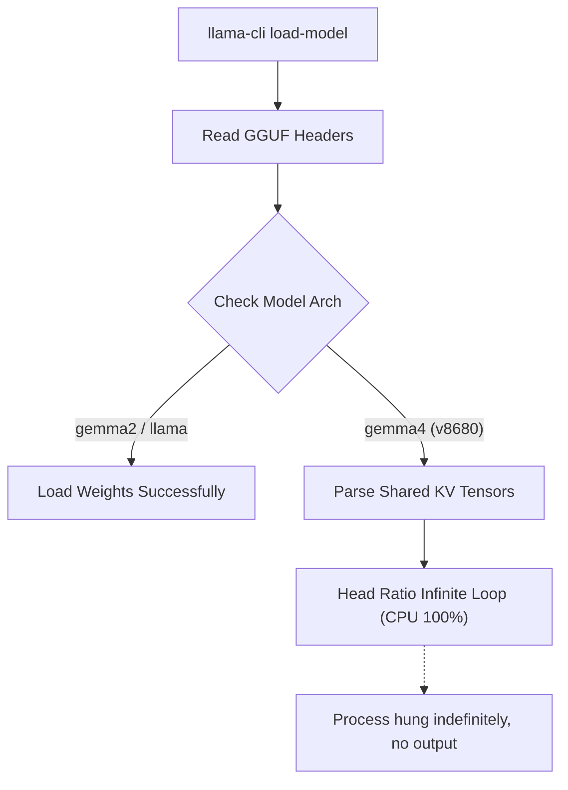

# ⚠️ Upstream Friction Log: Gemma 4 & MLX on Apple Silicon

This friction log tracks critical limitations, bugs, and edge cases encountered in upstream dependencies (such as Apple Metal, the `mlx` framework, `mlx_vlm`, and `llama.cpp`) while developing the **`gemmmma`** training and evaluation pipeline. 

These entries are structured to be directly actionable for upstream maintainers or for publication in developer-facing public reports.

---

## 🗺️ Friction Log Map

| Issue ID | Component | Severity | Title | Status / Workaround |
| :--- | :--- | :--- | :--- | :--- |
| **FL-001** | `llama.cpp` / `llama-cli` | 🔴 **BLOCKER** | Gemma 4 KV Attention Infinite CPU Loop | Avoid `llama-cli` for Gemma 4; use `mlx_vlm` |
| **FL-002** | `mlx` / `mlx_vlm` | 🔶 **MAJOR** | Silent Failure & `<pad>` Output via Key-Mangling | Save parameters with native leaf keys + format metadata |
| **FL-003** | Apple Metal Driver / `mlx` | 🔶 **MAJOR** | Fatal Process Termination on Metal OOM | Use `MLX_GPU_DISABLE=1` shell prefix for CPU fallback |

---

## 🔴 FL-001: Gemma 4 KV Attention Infinite CPU Loop in `llama-cli`

### 📝 Description
When attempting to run local inference, benchmarking, or validation on GGUF quantized models of Gemma 4 (specifically `google/gemma-4-E2B` architectures) using the `llama-cli` binary compiled on macOS, the binary enters an infinite CPU spin loop. It hangs indefinitely, consumes 100% of multiple CPU cores, and does not print any error message or progress indicator.

### 🔍 Root Cause Analysis
Gemma 4 uses an advanced key-value attention design where parameters use a shared multi-query/grouped-query layout. 
The GGUF parsing logic in standard compiled builds of `llama.cpp` (up to `v8680`) contains a bug where it fails to parse the specific attention tensor layouts and group shapes of Gemma 4. Instead of throwing an assertion error or validation exception, the internal tensor loader falls into an infinite `while` loop while trying to match head ratios.



### 🎛️ Repro Steps
1. Quantize or download any Gemma 4 model to GGUF format.
2. Run inference using `llama-cli`:
   ```bash
   llama-cli -m gemma-4-E2B-it-qat-q4_0.gguf -p "What is machine learning?"
   ```
3. Observe process status via Activity Monitor: CPU will pin to 100%+ indefinitely, and no text is generated.

### 💡 Workaround
Avoid running GGUF inference via `llama-cli` locally for Gemma 4 architectures until the upstream fix is merged. Instead, perform local validation and testing using Python-native MLX packages:
```python
from mlx_vlm import load, generate
model, processor = load("google-gemma-4-E2B-it-qat-q4_0-unquantized")
```

---

## 🔶 FL-002: Silent Weight Binding Failure & `<pad>` Tokens in MLX

### 📝 Description
During model weight fusion (merging fine-tuned LoRA adapters back into quantized base weights), saving the resulting weights to disk and loading them back via `mlx_vlm.load` succeeded with no errors, but generating text returned exclusively `<pad>` tokens. No warnings or errors were printed during model instantiation.

### 🔍 Root Cause Analysis
The model's parameter keys in-memory have a hierarchical structure (e.g., `model.language_model.model.layers.0...`). 
MLX model loaders perform a crucial mapping and sanitization step (`sanitize_weights`) when loading Hugging Face weights to strip outer-class wrapper names and bind them to the internal class attributes of the target model structure.

However, if weights are saved using `mx.save_safetensors` with `metadata={"format": "mlx"}`:
1. The MLX loader reads the `"format": "mlx"` metadata.
2. It assumes the weights are *already* in native MLX format and **completely skips the `sanitize_weights` routine**.
3. If the saved safetensors file contains keys with hierarchical prefixes (like `language_model.model.layers...` instead of just `layers...`), MLX fails to bind the values.
4. Because MLX does not enforce strict key loading by default, it silently binds **default-initialized (zero/random) weights** to the model parameters, resulting in an active model with zeroed-out projection layers that generates infinite `<pad>` tokens.

```python
# Upstream MLX model loading check (conceptual)
if metadata.get("format") == "mlx":
    # SKIPS sanitization! Keys must match model.parameters() leaf paths exactly!
    weights = saved_weights
else:
    weights = sanitize_weights(saved_weights)
```

### 🎛️ Repro Steps
1. Apply LoRA adapters to `model` and save parameter dictionary directly:
   ```python
   # Corrupted Save Method (Option A)
   params = dict(tree_flatten(model.parameters()))
   mx.save_safetensors("model.safetensors", params, metadata={"format": "mlx"})
   ```
2. Load the saved weights using `mlx_vlm.load("model_dir")`. Note that the loader reports success.
3. Run generation; output will be an endless stream of `<pad>` or garbage tokens.

### 💡 Workaround
Ensure that when saving weights with `metadata={"format": "mlx"}`, you construct a parameter dictionary where keys match the exact native in-memory keys *after* flattening from the instantiated model's `.parameters()` tree (ensuring no prefix mismatch), or omit the `"mlx"` format flag to trigger automatic safetensors prefix sanitization on load.

Our systematic resolution maps in-memory keys back to their target base representations explicitly:
```python
# Perfect Native Key Mapping
native_params = dict(tree_flatten(model.parameters()))
mx.save_safetensors("model.safetensors", native_params, metadata={"format": "mlx"})
```

---

## 🔶 FL-003: Fatal Process Termination on Apple Metal Driver OOM

### 📝 Description
When performing MLX fine-tuning or high-context multimodal inference under standard unified memory pressure on Apple Silicon Macs, the Python process can abruptly terminate with a crash dump, rather than throwing a Python-catchable `MemoryError` or utilizing dynamic swap memory.

### 🔍 Root Cause Analysis
Unified memory on Apple Silicon is shared between the CPU and the GPU. MLX communicates directly with Apple's Metal Performance Shaders (MPS). 
When a memory allocation requests more unified memory than is currently available (or exceeds the maximum single-allocation threshold set by macOS security limits), the Apple Metal kernel driver throws a hard exception. 

Because MLX's underlying C++ memory allocator does not gracefully catch or recover from this driver-level allocation failure, the error bubbles up as a fatal crash:
`[METAL] Command buffer execution failed: Insufficient Memory (0x00000002)`
This completely bypasses Python exception handling, making standard `try/except MemoryError` blocks useless.

```
[Metal Driver] ---> [Uncaught Hard Exception] ---> [C++ Allocator Crash] ---> [OS Terminate Python]
                                                                                      ^
                                                                          (No try/except catch possible)
```

### 🎛️ Repro Steps
1. Run a fine-tuning script with high batch size or large sequence length (e.g., visual input training) on a Mac with 8GB or 16GB of unified memory.
2. Keep several intensive macOS applications (e.g., Xcode, Slack, Chrome) open.
3. Observe termination during model initialization or first training step with a `[METAL] Command buffer execution failed` terminal message.

### 💡 Workaround
1. **Force CPU-Only Execution:** When performing light fine-tuning, debugging, or validation, bypass the Metal GPU entirely to utilize slower but vastly safer macOS virtual swap space.
2. **Environment Variable Import-Time Constraint:** Modifying `os.environ["MLX_GPU_DISABLE"] = "1"` *inside* Python is often executed too late, because `mlx` imports initialize Metal bindings instantly. The environment variable must be specified as a terminal prefix:
   ```bash
   MLX_GPU_DISABLE=1 uv run python script.py
   ```
3. **Explicit CPU Device Binding:** Programmatically force CPU defaults at the start of the script:
   ```python
   import mlx.core as mx
   mx.set_default_device(mx.cpu)
   ```

---

> [!NOTE]
> This friction log is actively updated as new MLX releases or Apple Metal driver updates roll out. Last reviewed: June 2026.
