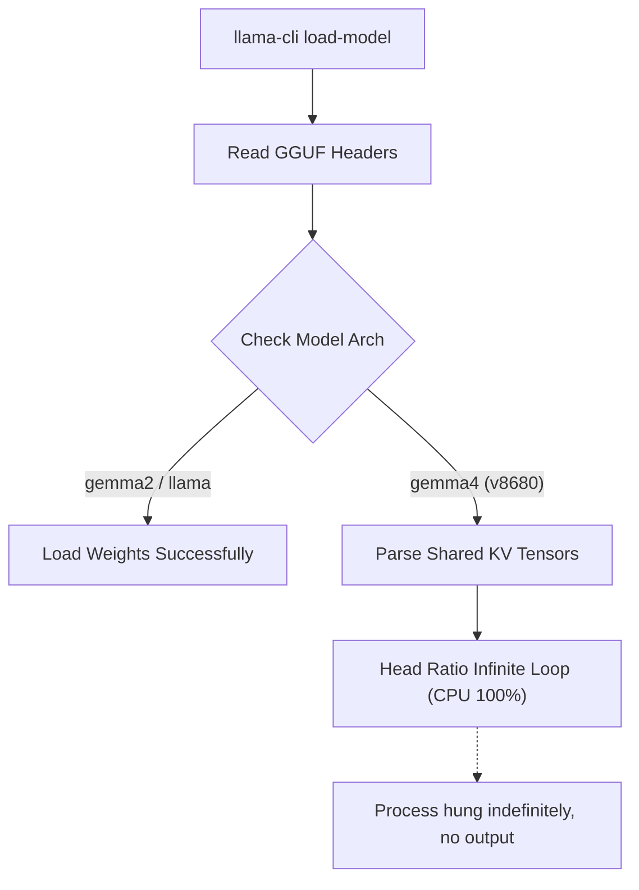
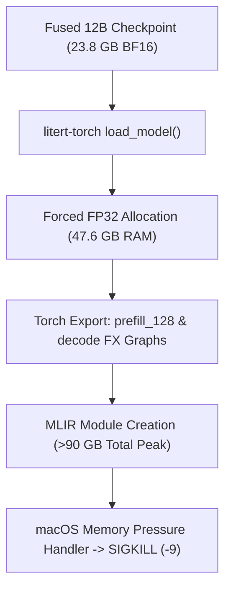

# ⚠️ Upstream Friction Log: Gemma 4 & MLX on Apple Silicon

This friction log tracks critical limitations, bugs, and edge cases encountered in upstream dependencies (such as Apple Metal, the `mlx` framework, `mlx_vlm`, and `llama.cpp`) while developing the **`gemmmma`** training and evaluation pipeline. 

These entries are structured to be directly actionable for upstream maintainers or for publication in developer-facing public reports.

---

## 🗺️ Friction Log Map

| Issue ID | Component | Severity | Title | Status / Workaround |
| :--- | :--- | :--- | :--- | :--- |
| **FL-001** | `llama.cpp` / `llama-cli` | 🔴 **BLOCKER** | Gemma 4 KV Attention Infinite CPU Loop | Avoid `llama-cli` for Gemma 4; use `mlx_vlm` |
| **FL-002** | `mlx` / `mlx_vlm` | 🔶 **MAJOR** | Silent Failure & `<pad>` Output via Key-Mangling | Save parameters with native leaf keys + format metadata |
| **FL-003** | Apple Metal Driver / `mlx` | 🔶 **MAJOR** | Fatal Process Termination on Metal OOM | Use `MLX_GPU_DISABLE=1` shell prefix for CPU fallback |
| **FL-004** | `litert-torch` (v0.9.1) | 🔶 **MAJOR** | 12B LiteRT-LM Export OOM (Hardcoded FP32 Load, No Offloading) | Ship 12B via GGUF q4_0 + MLX 4-bit; LiteRT-LM for E2B/E4B only |
| **FL-005** | Our pipeline / `convert_hf_to_gguf.py` | 🔴 **BLOCKER** | Gemma 4 GGUF Built With Gemma 2 `tokenizer.model` (Unloadable) | Never copy a `tokenizer.model` the source checkpoint doesn't ship; verify vocab = 262144 |
| **FL-006** | `mlx_lm` training (raw `text` data) | 🔶 **MAJOR** | LoRA Trained Without `<bos>` Doesn't Transfer to llama.cpp / HF on Gemma 4 E4B | Train with chat-template (`messages`) data, or prepend `<bos>` to raw text |

---

## 🔴 FL-001: Gemma 4 KV Attention Infinite CPU Loop in `llama-cli`

### 📝 Description
When attempting to run local inference, benchmarking, or validation on GGUF quantized models of Gemma 4 (specifically `google/gemma-4-E2B` architectures) using the `llama-cli` binary compiled on macOS, the binary enters an infinite CPU spin loop. It hangs indefinitely, consumes 100% of multiple CPU cores, and does not print any error message or progress indicator.

### 🔍 Root Cause Analysis
Gemma 4 uses an advanced key-value attention design where parameters use a shared multi-query/grouped-query layout. 
The GGUF parsing logic in standard compiled builds of `llama.cpp` (up to `v8680`) contains a bug where it fails to parse the specific attention tensor layouts and group shapes of Gemma 4. Instead of throwing an assertion error or validation exception, the internal tensor loader falls into an infinite `while` loop while trying to match head ratios.



### 🎛️ Repro Steps
1. Quantize or download any Gemma 4 model to GGUF format.
2. Run inference using `llama-cli`:
   ```bash
   llama-cli -m gemma-4-E2B-it-qat-q4_0.gguf -p "What is machine learning?"
   ```
3. Observe process status via Activity Monitor: CPU will pin to 100%+ indefinitely, and no text is generated.

### 💡 Workaround
Avoid running GGUF inference via `llama-cli` locally for Gemma 4 architectures until the upstream fix is merged. Instead, perform local validation and testing using Python-native MLX packages:
```python
from mlx_vlm import load, generate
model, processor = load("google-gemma-4-E2B-it-qat-q4_0-unquantized")
```

---

## 🔶 FL-002: Silent Weight Binding Failure & `<pad>` Tokens in MLX

### 📝 Description
During model weight fusion (merging fine-tuned LoRA adapters back into quantized base weights), saving the resulting weights to disk and loading them back via `mlx_vlm.load` succeeded with no errors, but generating text returned exclusively `<pad>` tokens. No warnings or errors were printed during model instantiation.

### 🔍 Root Cause Analysis
The model's parameter keys in-memory have a hierarchical structure (e.g., `model.language_model.model.layers.0...`). 
MLX model loaders perform a crucial mapping and sanitization step (`sanitize_weights`) when loading Hugging Face weights to strip outer-class wrapper names and bind them to the internal class attributes of the target model structure.

However, if weights are saved using `mx.save_safetensors` with `metadata={"format": "mlx"}`:
1. The MLX loader reads the `"format": "mlx"` metadata.
2. It assumes the weights are *already* in native MLX format and **completely skips the `sanitize_weights` routine**.
3. If the saved safetensors file contains keys with hierarchical prefixes (like `language_model.model.layers...` instead of just `layers...`), MLX fails to bind the values.
4. Because MLX does not enforce strict key loading by default, it silently binds **default-initialized (zero/random) weights** to the model parameters, resulting in an active model with zeroed-out projection layers that generates infinite `<pad>` tokens.

```python
# Upstream MLX model loading check (conceptual)
if metadata.get("format") == "mlx":
    # SKIPS sanitization! Keys must match model.parameters() leaf paths exactly!
    weights = saved_weights
else:
    weights = sanitize_weights(saved_weights)
```

### 🎛️ Repro Steps
1. Apply LoRA adapters to `model` and save parameter dictionary directly:
   ```python
   # Corrupted Save Method (Option A)
   params = dict(tree_flatten(model.parameters()))
   mx.save_safetensors("model.safetensors", params, metadata={"format": "mlx"})
   ```
2. Load the saved weights using `mlx_vlm.load("model_dir")`. Note that the loader reports success.
3. Run generation; output will be an endless stream of `<pad>` or garbage tokens.

### 💡 Workaround
Ensure that when saving weights with `metadata={"format": "mlx"}`, you construct a parameter dictionary where keys match the exact native in-memory keys *after* flattening from the instantiated model's `.parameters()` tree (ensuring no prefix mismatch), or omit the `"mlx"` format flag to trigger automatic safetensors prefix sanitization on load.

Our systematic resolution maps in-memory keys back to their target base representations explicitly:
```python
# Perfect Native Key Mapping
native_params = dict(tree_flatten(model.parameters()))
mx.save_safetensors("model.safetensors", native_params, metadata={"format": "mlx"})
```

---

## 🔶 FL-003: Fatal Process Termination on Apple Metal Driver OOM

### 📝 Description
When performing MLX fine-tuning or high-context multimodal inference under standard unified memory pressure on Apple Silicon Macs, the Python process can abruptly terminate with a crash dump, rather than throwing a Python-catchable `MemoryError` or utilizing dynamic swap memory.

### 🔍 Root Cause Analysis
Unified memory on Apple Silicon is shared between the CPU and the GPU. MLX communicates directly with Apple's Metal Performance Shaders (MPS). 
When a memory allocation requests more unified memory than is currently available (or exceeds the maximum single-allocation threshold set by macOS security limits), the Apple Metal kernel driver throws a hard exception. 

Because MLX's underlying C++ memory allocator does not gracefully catch or recover from this driver-level allocation failure, the error bubbles up as a fatal crash:
`[METAL] Command buffer execution failed: Insufficient Memory (0x00000002)`
This completely bypasses Python exception handling, making standard `try/except MemoryError` blocks useless.

```
[Metal Driver] ---> [Uncaught Hard Exception] ---> [C++ Allocator Crash] ---> [OS Terminate Python]
                                                                                      ^
                                                                          (No try/except catch possible)
```

### 🎛️ Repro Steps
1. Run a fine-tuning script with high batch size or large sequence length (e.g., visual input training) on a Mac with 8GB or 16GB of unified memory.
2. Keep several intensive macOS applications (e.g., Xcode, Slack, Chrome) open.
3. Observe termination during model initialization or first training step with a `[METAL] Command buffer execution failed` terminal message.

### 💡 Workaround
1. **Force CPU-Only Execution:** When performing light fine-tuning, debugging, or validation, bypass the Metal GPU entirely to utilize slower but vastly safer macOS virtual swap space.
2. **Environment Variable Import-Time Constraint:** Modifying `os.environ["MLX_GPU_DISABLE"] = "1"` *inside* Python is often executed too late, because `mlx` imports initialize Metal bindings instantly. The environment variable must be specified as a terminal prefix:
   ```bash
   MLX_GPU_DISABLE=1 uv run python script.py
   ```
3. **Explicit CPU Device Binding:** Programmatically force CPU defaults at the start of the script:
   ```python
   import mlx.core as mx
   mx.set_default_device(mx.cpu)
   ```

---

## 🔶 FL-004: 12B Model LiteRT-LM Export OOM (`SIGKILL` / Exit Code -9) in `litert-torch`

### 📝 Description
When attempting to compile a 12B parameter model (such as fused Gemma 4 12B) to Google's `.litertlm` format using `litert-torch export_hf` on a 32GB Apple Silicon workstation, the process is abruptly terminated with exit code `-9` (`SIGKILL` issued by the macOS kernel under severe memory pressure). The death occurs precisely during the `Lower to MLIR: prefill_128 > Create MLIR Module` stage after torch export traces.

The identical export script (`compile_litert.py`) executes flawlessly for smaller Gemma 4 variants (e.g. E2B and E4B).

### 🔍 Root Cause Analysis
The failure is an upstream memory-scaling limitation inside `litert-torch` (v0.9.1), **not** a defect in our pipeline wrapper.

1. **Hardcoded FP32 Load:** In `litert_torch/generative/export_hf/core/export_lib.py:117-148`, the `load_model()` routine explicitly sets `dtype=torch.float32` / `torch_dtype=torch.float32`. It does **not** expose or utilize `low_cpu_mem_usage=True`, `device_map="auto"`, or disk-offload hooks.
2. **Memory Cliff:** When loading a ~12B model whose base weights are ~23.8 GB in BF16 (2 bytes/param), forcing FP32 (4 bytes/param) instantly expands the working set to **~47.6 GB** in system RAM—already exceeding 32 GB physical memory before graph tracing starts.
3. **Graph Duplication during MLIR Lowering:** The PyTorch export pipeline (`torch.export`) creates intermediate `ExportedProgram` fx graphs for both `prefill_128` and `decode` paths, followed by MLIR module materialization. Peak memory requirement easily exceeds **>90 GB**.

| Stage | Memory Footprint (12B Model) |
| :--- | :--- |
| Fused checkpoint on disk (BF16) | ~23.8 GB |
| **Loaded in memory by `litert-torch` (FP32)** | **~47.6 GB** *(exceeds 32GB RAM)* |
| + `torch.export` `ExportedProgram` graphs | +10–15 GB (tensor refs + decompositions) |
| + MLIR Module materialization | +25–30 GB duplicate representation |
| **Effective Peak Required** | **>90 GB** |



### 🎛️ Repro Steps
1. Fuse LoRA weights into a 12B HuggingFace model checkpoint directory.
2. Run `litert-torch export_hf`:
   ```bash
   litert-torch export_hf \
       --model=/path/to/12B_fused_model \
       --output_dir=/path/to/models/litert \
       --quantization_recipe=dynamic_wi8_afp32 \
       --externalize_embedder
   ```
3. Process progresses through model load (1:21) and Torch Export (1:45), then terminates abruptly with `exit code -9` at `Lower to MLIR: prefill_128 > Create MLIR Module`.

### 💡 Status & Workaround
- **Operational Policy:** Deploy 12B models on-device using **GGUF `q4_0`** (~7.0 GB) and **Apple MLX 4-bit SafeTensors** (6.5 GB). *Correction (Sept 2026):* the 12B GGUF originally shipped with this policy was unloadable (FL-005); it was rebuilt and verified to load and generate in llama.cpp. The MLX 4-bit build was unaffected.
- **Target Audience Alignment:** LiteRT-LM is specifically designed for mobile phone NPUs and edge micro-runtimes, where 12B models are generally impractical. LiteRT-LM export remains active and fully supported for Gemma 4 **E2B** and **E4B** models.
- **Back-Pocket Upstream Fix (Option 2):** If 12B LiteRT-LM export becomes a strict requirement, patch `litert_torch.generative.export_hf.core.export_lib.load_model` to pass `low_cpu_mem_usage=True` with dynamic layer-by-layer offloading, or run the export task on a 128GB+ host.

---

## 🔴 FL-005: Gemma 4 GGUF Built With a Gemma 2 `tokenizer.model` (Unloadable)

### 📝 Description
The first Eldamo Gemma 4 12B GGUF (`eldamo-gemma-q4_0.gguf`) converted and quantized without errors, but llama.cpp refused to load it:
```
check_tensor_dims: tensor 'token_embd.weight' has wrong shape; expected 3840, 262144, got 3840, 256000
```

### 🔍 Root Cause Analysis
This was our pipeline's fault, not an upstream bug. Gemma 4 checkpoints ship **only `tokenizer.json`** (vocab **262,144**) and no SentencePiece `tokenizer.model`. When llama.cpp's converter asked for a `tokenizer.model`, we copied `gemmma/model/tokenizer.model` into the fused directory. That file came from the **Gemma 2** test model (vocab **256,000**). The converter preferred it over `tokenizer.json`, so it wrote a 256,000-row vocabulary and embedding. Conversion "succeeded" and the error only showed up at load time.

### 🎛️ Repro Steps
1. Fuse a Gemma 4 LoRA into a HF-format directory.
2. Copy any Gemma 2/3 `tokenizer.model` into that directory.
3. Run `convert_hf_to_gguf.py` + `llama-quantize`, then load the result in llama.cpp.

### 💡 Workaround
- Never add a `tokenizer.model` that the **source checkpoint** doesn't ship. The mlx-tune GGUF export (`ghchinoy/mlx-tune@fix/gguf-export-llama-cpp`) copies tokenizer assets only from the source model, so it avoids this by design.
- Verify every Gemma 4 GGUF before shipping it: `token_embd.weight` must be `[hidden, 262144]` and `tokenizer.ggml.tokens` must have 262,144 entries.
- Resolved (Sept 2026): the 12B was retrained with the fork's mlx-tune (100 iters, val loss 6.14 → 3.75) and exported with `export_to_gguf(qat=True)`. The resulting GGUF is structurally identical to Google's official 12B QAT GGUF (same 667 tensors, types and shapes) and generates correctly in llama.cpp. It replaced the broken file.

---

## 🔶 FL-006: LoRA Trained Without `<bos>` Doesn't Transfer to llama.cpp / HF on Gemma 4 E4B

### 📝 Description
A LoRA trained with mlx-tune on **raw `{"text": ...}` data** on Gemma 4 E4B answered correctly in MLX. The same weights exported to GGUF (at f16, q8_0 and q4_0 alike) gave the base-like or broken answer in llama.cpp. The E2B model with the same recipe transferred fine.

### 🔍 Root Cause Analysis
The weights in the export were correct. MLX, loading the merged HF directory, still gave the trained answer, and only the LoRA-targeted tensors differed from the base. The difference was the **`<bos>` token**:
- The Gemma 4 tokenizer has `add_bos_token: false`, so mlx-lm's `TextDataset` trains on **text without `<bos>`**, and `mlx_lm.generate` also prompts without it.
- llama.cpp (from GGUF metadata) and Hugging Face transformers **prepend `<bos>`**.
- With `<bos>` in front, the MLX-trained E4B behaved like the base model even inside MLX. The LoRA had only learned the no-`<bos>` distribution, and E4B is sensitive to it.

Confirmed by retraining with `<bos>` included in the text. That run passed end to end: MLX, the q4_0 GGUF in llama.cpp, and the base-model control all behaved as expected. Chat-format (`messages`) data isn't affected, because the Gemma 4 chat template starts with `<bos>`. The Eldamo training data is chat format.

### 💡 Workaround
- Prefer `messages` / chat-template training data for Gemma 4.
- For raw-text data, prepend `<bos>` (or the tokenizer's `bos_token`) to each sample.
- When comparing MLX and GGUF outputs, feed both the same tokens (`<bos>` included).

---

> [!NOTE]
> This friction log is actively updated as new MLX releases or Apple Metal driver updates roll out. Last reviewed: September 2026.
