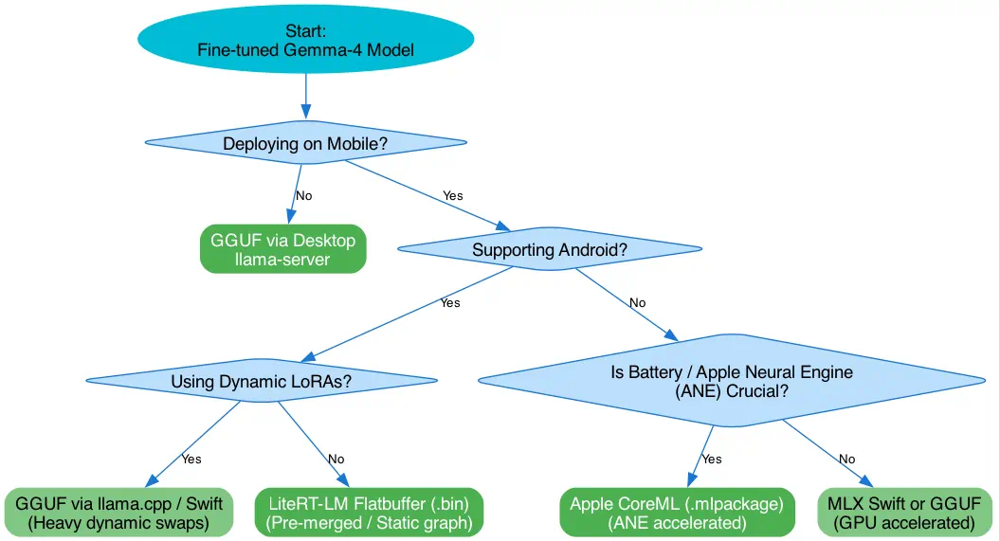

# On-Device Mobile Model Runtimes: Decision Tree & Tradeoffs

This document outlines the core architectures, memory patterns, hardware performance, and constraints of executing fine-tuned Gemma models locally on mobile devices. 

---

## 1. Executive Summary

Deploying LLMs directly to mobile devices (iOS & Android) enables **100% offline functionality, absolute privacy, and zero server hosting costs**. However, standard development environments (like `llama-server`) are designed for persistent desktop machines. Mobile operating systems strictly enforce **sandboxed memory limits** (often killing processes that exceed 1.5GB–2.0GB of RAM on standard devices) and heavily restrict continuous background processing.

To compile a fine-tuned model (e.g., our Elvish assistant) for mobile, the tuning team can choose between four core runtimes.

---

## 2. Platform Comparison Matrix

| Dimension | GGUF (`llama.cpp`) | LiteRT-LM (Google) | MLX Swift (Apple) | CoreML (Apple Native) |
| :--- | :---: | :---: | :---: | :---: |
| **Primary Engine** | `llama.cpp` (C++) | LiteRT (`ai-edge-litert`) | MLX (Apple Metal) | Apple CoreML Framework |
| **Compatible OS** | iOS, Android, Desktop | iOS, Android, Chrome OS | iOS, macOS | iOS, iPadOS, macOS |
| **Quantization** | INT4, INT5, INT8, FP16 | Dynamic INT8 (dynamic_wi8_afp32) | INT4, INT8, FP16 | INT4, INT8, FP16 |
| **Hardware Target** | CPU, GPU (Metal/Vulkan) | GPU (Metal/Vulkan), NPU | GPU (Apple Unified Memory) | Apple Neural Engine (ANE) |
| **LoRA Hot-Loading**| **Supported (Dynamic)** | **Not Supported** (Pre-Merged) | **Supported (Dynamic)** | **Not Supported** (Pre-Merged) |
| **File Sizes** | ~1.4GB (Q4) to 2.2GB (Q8) | ~3.2GB (Dynamic INT8) | ~1.4GB (Q4) | ~1.3GB (Q4) |
| **RAM Footprint** | Moderate (Highly tunable) | Extremely Low (NPU Optimized)| Moderate to High | Low (Highly compressed) |
| **Battery Impact** | Moderate to High (CPU/GPU) | Extremely Low (NPU / Vulkan)| Low to Moderate | Extremely Low (ANE) |

---

## 3. The 4 Runtimes: Deep Dive

### A. GGUF via `llama.cpp` / Swift
The standard cross-platform format. By compiling `libllama` statically inside your iOS or Android app, you can load standard GGUF files.
*   **Best For:** Fast cross-platform prototyping; apps that need to hot-swap several LoRA adapters (e.g. changing the model's dialect on the fly).
*   **tradeoffs:** Lacks direct optimization for mobile NPUs, leading to higher CPU/GPU activity, which can cause thermal throttling and drain the battery faster under continuous use.

### B. LiteRT-LM (Google On-Device LLM Inference)
Google's official lightweight runtime for on-device AI. Models are converted into highly optimized `.litertlm` model package flatbuffers using the modern `litert-torch` compilation toolchain.
*   **Best For:** Highly efficient, battery-friendly cross-platform applications (iOS + Android) that require predictable performance.
*   **tradeoffs:** Absolutely static. You cannot hot-swap LoRA adapters at runtime. Your adapters *must* be mathematically pre-merged (fused) into the base weights before conversion.

### C. MLX Swift
Apple Silicon's native research framework, now portable to Swift on iOS.
*   **Best For:** Premium, high-performance apps restricted strictly to modern iOS devices (A17 Pro, Apple M-series chips). It leverages Apple's Unified Memory Architecture natively without conversion loss.
*   **tradeoffs:** Completely incompatible with Android or older Apple devices lacking unified memory architectures.

### D. CoreML (Apple Native)
Apple's system-level machine learning format. Weights are converted to `.mlpackage` via `coremltools`.
*   **Best For:** Maximum battery efficiency on iOS. CoreML is the only runtime that can run large networks directly on Apple’s dedicated **Neural Engine (ANE)**, freeing up the primary GPU and CPU completely.
*   **tradeoffs:** The most complex conversion pipeline. PyTorch models must be translated into intermediate Graphs before compiling. There is no cross-platform compatibility.

---



---

## 5. Weight Pipelines: How They Differ

To generate these outputs, the training team starts with the exact same base model and training checkpoint (Hugging Face Safetensors) and routes them through three separate compilation paths:

### Path A: GGUF Target
```
HF Base + Checkpoint ──> mlxtune fuse ──> Dequantized Safetensors ──> llama.cpp convert ──> GGUF (e.g. Q4_K_M)
```

### Path B: LiteRT-LM Target
```
HF Base + Checkpoint ──> mlxtune fuse ──> Fused Dequantized Weights ──> litert-torch export_hf ──> Model Package (.litertlm)
```
*(By passing `--prefused` pointing to the output of `mlxtune fuse`, we bypass heavy on-the-fly PEFT loading, reducing compilation RAM usage by over 5GB).*

### Path C: MLX Swift Target
```
HF Base + Checkpoint ──> mlxtune fuse ──> Standard MLX directory containing weights.safetensors & config.json
```

---

## 6. Guidelines for Swift App Onboarding & Storage

When loading models on mobile, the iOS app sandbox imposes strict guidelines:

1.  **Never bundle model files inside the App Store binary:** Adding a 1.4GB model directly to your Xcode asset catalog will make the app exceed App Store cellular download limits, and users will be blocked from downloading it over-the-air.
2.  **Dynamic Downloading Workflow:**
    *   On first launch, present an onboarding wizard (similar to our XML database Setup wizard).
    *   Fetch model file size and display a progress bar.
    *   Store the downloaded file inside the **Application Support Directory** (which Apple keeps persistent but excludes from standard iCloud backups so users' cloud storage isn't exhausted by model files).
    *   Validate the file integrity on boot using an MD5 or SHA256 checksum before initializing the runtime.
3.  **Graceful Fallback:** Always allow the app to operate in "Offline-Dictionary-Only" mode if a model download is cancelled or failed.
